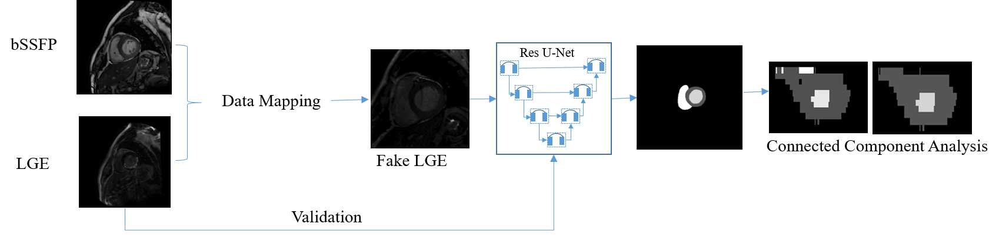
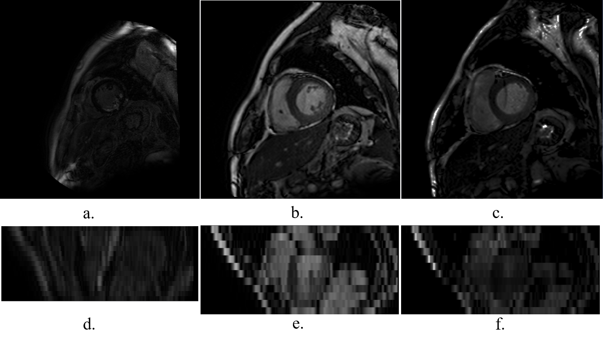
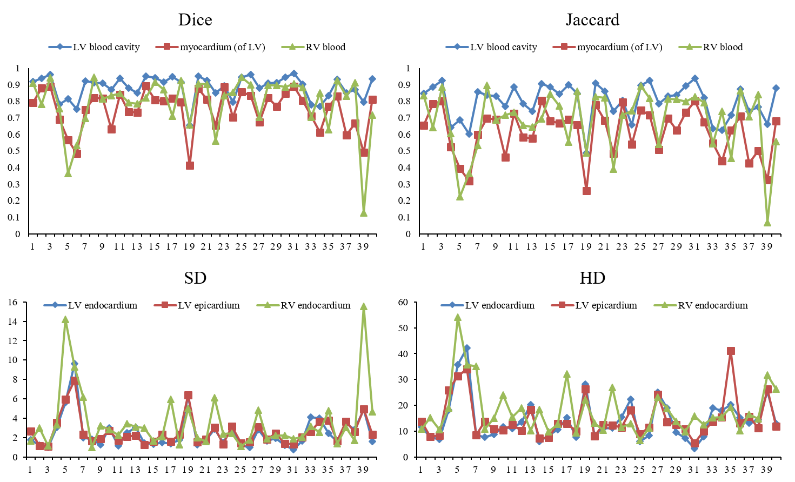
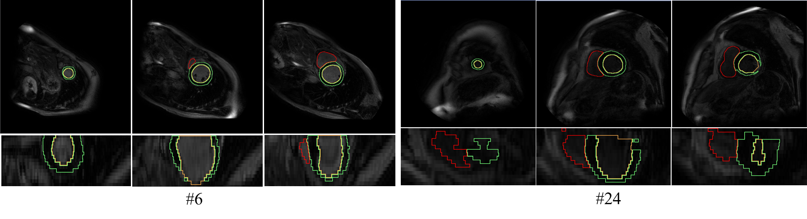

# MS-CMR2019
Code for our [2019 Multi-sequence Cardiac MR Segmentation Challenge](https://zmiclab.github.io/mscmrseg19/) paper ["An Automatic Cardiac Segmentation Framework based on Multi-sequence MR Image"](https://arxiv.org/abs/1909.05488). The main purpose of this challenge is segmenting left ventricle (LV), right ventricle (RV) and left ventricle myocardium (LVM) from LGE CMR data. It published 45 patients CMR data with three modalities, T2, b-SSFP, and LGE. There are 35 labeled T2 CMR data with about 3 slices of each patient, and 35 labeled b-SSFP CMR data with about 11 slices of each patient, and just 5 labeled LGE CMR data with about 15 slices of each patient. The rest volumes are unlabeled data. The rarely labeled target data increases the challenge sharply. For this challenge, we proposed an automatic segmentation framework. 

The pipeline of our method is show below:

<p align="center">
    
</p>

## Requirements

Python 3.5

Keras based on Tensorflow

## Data process

The data mapping is utilized histogram match method, which is an easy and efficient method for this challenge. It matches the histogram of the source image to the target histogram by establishing the relationship between the source image and the target image. Moreover, the shape of the source image is still maintained. That is mean that the label of fake LGE CMR images is still consistent with the original b-SSFP CMR images. 

The LGE CMR data are resized to the shape of the b-SSFP CMR. Then, the 2D images are obtained along the short axis. The target histogram for each b-SSFP image is calculating from the corresponding LGE image. An example of the resized LGE image, b-SSFP image, and fake LGE image is shown below. a-c are corresponding to the short axis LGE, b-SSFP, and fake LGE generating from a and b; d-f are corresponding to the long axis LGE, bSSFP, and fake LGE. 

<p align="center">
    
</p>

In order to keep the same input to the model, we resize all images into (256, 256). After data analysis, we center crop the resized images into (144,144) to filter the unrelated background. The output of the model will do the inverse operation to keep the data consistency. Moreover, the evaluation is performed on the 3D volumes. 

## Training

In order to maximize the data utilization, we divide the 5 labeled LGE volumes into 5 groups by the **leave-one-out strategy**. At last, we have trained 5 models, and the training data of each model consists of 35 fake LGE volumes and 4 real LGE volumes. The rest one real LGE volume is utilized to evaluate the model. The final prediction is determined by the average of these models. Each model has trained **300 epochs** with **0.001** learning rate and **8 batch size**. The training time is about 1 hour for each model.  

**Folder structure**:

```python
traindata_dir = 'data/histogram/train/img'
trainlabel_dir = 'data/histogram/train/gt'
valdata_dir = 'data/histogram/val/img'
vallabel_dir = 'data/histogram/val/gt'
```

**Run**

```python
train: python train.py
```

Testing is on the 40 unlabeled LGE CMR data. The testing data should be kept in the original status. The data pre-process is processed on the test_LOO.py. 

```python
test: python test_LOO.py
```

After training the segmentation model, we reconstruct the prediction results in the original shape. Then, a connected component analysis is performed to remain the largest connected region for each class as the final segmentation result. Our segmentation model is evaluated by the official evaluation metrics, which are **Dice score**, **Jaccard score**, **Surface distance (SD)**, and **Hausdorff distance (HD)**. 

## Results

The score of metrics during the validation stage is shown in the Table. These scores are the mean value of the three classes, which are calculated by average operation without weighted.

| Patient | Dice Score | Jaccard Score | SD (mm) | HD (mm) |
| :-----: | :--------: | :-----------: | :-----: | :-----: |
|   #1    |   0.9289   |    0.8685     | 0.3873  | 6.6570  |
|   #2    |   0.9461   |    0.8997     | 0.3012  | 14.2289 |
|   #3    |   0.9277   |    0.8665     | 0.3761  | 5.8568  |
|   #4    |   0.9416   |    0.8899     | 0.2801  | 4.8050  |
|   #5    |   0.9128   |    0.8439     | 0.4608  | 5.7329  |
|  Mean   |   0.9315   |    0.8737     | 0.3611  | 7.4561  |

The score of metrics during the testing stage is shown in the following chart. The testing segmentation result is evaluated by the organizer. The patient IDs are anonymous, but
their orders are consistent across the four metrics.  

<p align="center">
    
</p>

Two random selected segmentation examples, patient 6 and patient 24, are shown below. The green, red and yellow contours represent LVM, RV and LV, respectively. The three columns of each patient are from three different slices in order to demonstrate a comprehensive result of the proposed model. 

<p align="center">
    
</p>

## Citation

Please consider citing this project in your publications if it helps your research. The following is a BibTeX reference. The BibTeX entry  requires the `url` LaTeX package.

```latex
@article{Liu2019AnAC,
  title={An Automatic Cardiac Segmentation Framework based on Multi-sequence MR Image},
  author={Yashu Liu and Wei Wang and Kuanquan Wang and Chengqin Ye and Gongning Luo},
  journal={ArXiv},
  year={2019},
  volume={abs/1909.05488}
}
```